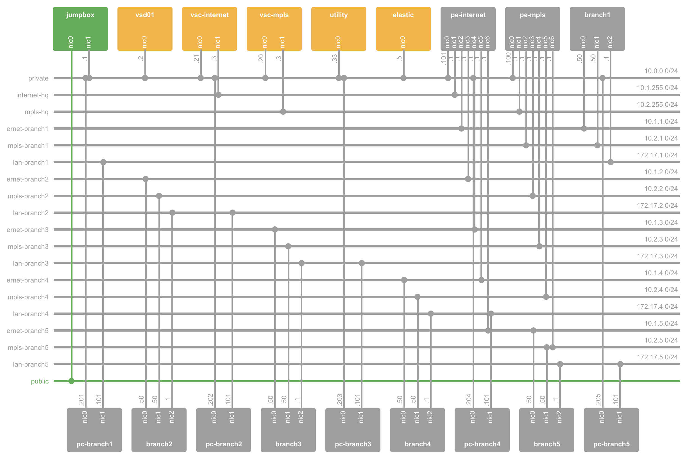

This document explains how a partner should integrate with the Nuage Networks VSP to discover the content of the platform (Topologies, Gateways, ...) and/or poll statistics information of SD-WAN resources.

This integration guide does not cover all the statistics the Nuage Networks VSP exposes. It focuses on the different use cases SD-WAN customers are requesting when it comes to gathering statistics and/or collecting resource definitions.

# Lab environment deployment (Internal Nuage Networks)

> As of writing, a partner is not yet able to deploy a complete lab environment on NuageX due to lack of access to some automation tools

This lab is the reference environment for Monitoring & Visibility integrations. The lab environment runs on [NuageX](https://nuagex.io). The deployment is handled by [`nuxctl`](https://nuxctl.nuagex.io) and the services & resources provisioning is automated using [CATS](https://cats-docs.nuageteam.net).

## Deploy the environment (Internal Nuage Networks)

Leverage [nuxctl](https://nuxctl.nuagex.io) to deploy the lab in a single command.

First, make a copy of the `monitoring_visbility_integration_5.2.3.yml` into `monitoring_visbility_integration_5.2.3_<partner name>.yml` to avoid modifying the main definition.

Then, create a new SSH key pair for the partner if one is not yet available. The following command will generate a key pair (public/private) name `partner.<partner name>` where `<partner name>` is the name of the partner.

```bash
ssh-keygen -f partner.<partner name>
```

Then, edit `monitoring_visbility_integration_5.2.3_<partner name>.yml` to modify
- Expiration date
- Environment name
- SSH Keys, add the public key generated above `partner.<partner name>.pub`

Once updated, you can deploy the lab environment

```
nuxctl create-lab -l monitoring_visbility_integration_5.2.3_<partner name>.yml
```

The deployment should take couple of minutes. When the environment is running, write down the Public IP of the Lab and the `admin` user password for VSD.

Connect to the Nuage Networks VSD using `csproot` account (known by the Nuage Networks team). Create a new csp user named `admin` with the password recorded above. Associate this new user to the `Root Group` group in Nuage Networks VSD.

## Configure the use case (Internal Nuage Networks)

Use [CATS](https://cats-docs.nuageteam.net) framework and provided Test Suite. 

1. Change the `${jumpbox_address}` value in the [`enterprise1/vars.robot`](cats_setup/enterprise1/vars.robot#L32) and [`enterprise2/vars.robot`](cats_setup/enterprise1/vars.robot#L37) file to the Public IP of the lab you have deployed.
2. Change the admin password held in [`enterprise1/vars.robot`](cats_setup/enterprise1/vars.robot#L42) and [`enterprise2/vars.robot`](cats_setup/enterprise2/vars.robot#L48) file to contain the password provided for your lab.
3. Update the SSH Key path in both [`enterprise1/vars.robot`](cats_setup/enterprise1/vars.robot#L31) and [`enterprise2/vars.robot`](cats_setup/enterprise2/vars.robot#L36) to use the private key file associated with the public key used in the nuxctl definition.
4. Deploy the first enterprise configuration
    ```bash
    cats -X -DD cats_setup/enterprise1
    ```
5. Deploy the second enterprise configuration
    ```bash
    cats -X -DD cats_setup/enterprise2
    ```

The lab environment is now ready to be shared with the partner.

## Share the environment details

Use the following template to share the environment details with the partner.

```bash
Hi <parter name>,

A lab environment has been provisioned for you to start your integration with the Nuage Networks VSP. This lab environment reflects a typical SD-WAN deployment and includes commonly deployed components.

When contacting us for help, please provide the following environment ID (see below) for us to easily locate your environment.

Environment ID: <environment id>
Expiration: <expiration data>
Exposed Services:
    - SSH Server to jump in the lab
        - URL: ssh://admin@<public IP>
        - Authentication: Private Key attached to this email
    - Nuage Networks VSD API/UI access
        - URL: https://<public IP>:8443
        - Authentication:
            - Username: admin
            - Password: <unique password>
            - Organization: csp
    - Nuage Networks ElasticSearch API
        - URL: https://<public IP>:6200
        - Authentication: None
    - Nuage Networks JMS bus
        - URL: tcp://<public IP>:61616
        - Authentication:
            - Username: admin
            - Password: <unique password>
            - Organization: csp
    - Nuage Networks AMQP bus
        - URL: tcp://<public IP>:5672
        - Authentication:
            - Username: admin
            - Password: <unique password>
            - Organization: csp
    - RDP access to Branch PCs
        - Name: pc-branch[1-5]
        - Port: rdp://<public IP>:3389[1-5]
        - Authentication:
            - Username: root
            - Password: Alcateldc

Best regards,
<XXXX>
```

# Getting started with the environment (Partner)

The lab environment deployed for you is based on the Nuage Networks VSP 5.2.3u2 release that most of our SD-WAN customers uses. The environment contains five branches spread in two enterprises. Each enterprise has one L3 domain containing one zone with several subnets. Each subnet is connected to an NSG access port using a BRIDGE interface. 

Five applications have been defined, HTTP, SSH, Video Stream RTP & RTSP and an Audio Stream. Each application has been associated with a different APM, Gold, Silver and Bronze. All APM have been attached to the same domain.

The five branches are represented in VSD by five distinct NSG (NSGateway). Each NSG is connected to two underlays, Internet & MPLS. No Egress QOS has been defined, you can ask us or configure EgressQOS yourself. All NSG have Direct Internet Access also called Underlay Routing in VSD.

We also configured some scheduled traffic generation between branches for the applications defined above (SSH, HTTP, Video Stream, ...). 

You should not have to do any configuration to start discovering and collecting metrics. The lab has been fully configured for you. If your customer has a specific use case/configuration, please reach out to us to discuss it and we will engage Product Management in the discussion to respond to your questions.



# Use cases

The Nuage Networks VSD exposes several interfaces to collect information. First, the Nuage Networks VSD has a northbound REST API ([Specifications](https://nuagenetworks.github.io/vsd-api-documentation/v5_0/)) which in your case can be consumed to discover the object structure defined in the VSD by the customers. 

The Nuage Networks VSP uses an ElasticSearch cluster to store statistics/metrics, this cluster exposes an [API](https://www.elastic.co/guide/en/elasticsearch/reference/current/docs.html) which can be queried to retrieve metrics either on demand or for re-collection on your on solution.

Finally, the Nuage Networks VSD has an event bus based ActiveMQ which is exposes as a JMS and/or AMQP bus. By default both JMS and AMQP are available and supported.

## Resource discovery

This section explains how to discover the common SD-WAN resources configured in the Nuage Networks VSD. When implementing the discovery mechanism, keep in mind that the default API page size is 500 which is also the maximum page size. You might need to issue multiple requests to discover all instances of a given resource. You can read [VSD API Usage](https://nuagenetworks.github.io/vsd-api-documentation/usage.html) to understand how the pagination should be handled (passing X-Nuage-Page and X-Nuage-PageSize as request headers).

TO avoid re-discovering all objects every X hours/minutes, the implementation can take advantage of the JMS/AMQP bus. 
- First, collect all objects using the REST API
- Then, connect to the JMS bus and listen for events on the different object types (based on your firs collection)
- When an event occurs on the bus, update the resource in your system with the new value/values or create a new resource if the event is of type `CREATE`

Your solution can re-discover all objects using the REST API if disconnected from the bus during several minutes. 

A separate guide explains how to connect to the JMS bus.

### Discover organizations

At its core, the Nuage Networks VSP is fully multi-tenant. Each tenant is called an `Enterprise`. The `Enterprise` is the highest object in the API parent/child structure.

Recommended REST CALLs
- List `Enterprises`: `GET /enterprises/`
- Get an `Enterprise` by ID: `GET /enterprises/<enterprise id>`

### Discover VRF/VPN

In the Nuage Networks VSD, the VRF/VPN concept is called L3 Domain or just `Domain`. A `Domain` contains a set of `Zones`, each zone containing one or more `Subnets`. NSGateways (Nuage Networks NSG), aka. CPE `port/vlan` couple is used to define a `VPort` of type `BRIDGE` connected to a `Subnet`. A tuple `gateway/port/vlan` can only be attached to a single `VPort`.

Recommended REST CALLs
- List `Domains` within an enterprise: `GET /enterprises/<enterprise id>/domains`
- Get a `Domain` by ID: `GET /domains/<domain id>`
- List `Zones` from a `Domain`: `GET /domains/<domain id>/zones`
- List `Subnets` from a `Domain` (if you don't want to discover zones): `GET /domains/<domain id>/subnets`
- List `Subnets` from a `Zone`: `GET /zones/<zone id>/subnets`

### Discover Underlays

The Nuage Networks VSP solution has a concept of `Underlays`. An underlay can be seeb as a disjoint WAN. A VSP administrator will usually create one `Underlay` per disjoint WAN. For example, in your lab environment, there are two underlays: MPLS & Internet. The `Underlay` object has three important information, its `ID`, its short `UnderlayID` (used in UplinkConnection object, see below) and its name.

Recommended REST CALLs
- List `Underlays`: `GET /underlays`
- Get an `Underlay` by ID: `GET /underlays/<underlay id>`

### Discover CPEs

What is commonly named CPE is named NSG (Network Services Gateway) or NSGateway in the Nuage Networks VSP solution. A NSGateway is always instantiated from an NSGatewayTemplate. 
NSGatewayTemplate are defined by the `csp` administrator. 

Each NSGatewayTemplate contains a set of ports `NSPorts` which can either be `ACCESS` or `NETWORK`. `ACCESS` port are meant to be connected on the LAN side of a branch office. `NETWORK` port aka. `UPLINKS` are meant to be facing the Internet/MPLS/LTE/... aka. `Underlay` in the Nuage Networks VSD. 

As of writing, `NETWORK` ports can only have a single `VLAN`. On this `VLAN`, only one `UplinkConnection` can be created. The `UplinkConnection` defines the characteristics of the uplink, typically the uplink IP address configuration method (DHCP or static), the `Underlay` mapping. The `UplinkConnection` object has an `underlayID` attribute (not the UUID) you can use to correlate the `Underlay` information.

Optionally, an `EgressQOSPolicy` can be associate with an uplink `VLAN`. An Egress QoS Policy is a policy that groups rate-limiting profiles and Forwarding Classes (A to H) to different queues, q0to q4, where q0 is called the Parent Queue (sum of all queues).

Recommended REST CALLs
- List `NSGateways` within an enterprise: `GET /enterprises/<enterprise id>/nsgateways`
- Get an `NSGateway` by ID: `GET /nsgateways/<nsgateway id>`
- List `NSPorts` from `NSGateway`: `GET /nsgateways/<nsgateway id>/nsports`
- List `VLANS` from `NSPort`: `GET /nsports/<nsport id>/vlans`
- Get `VLAN` by ID, contains the `associatedUplinkConnectionID` and optionally the `associatedEgressQOSPolicyID`: `GET /vlans/<vlan id>`

### Discover Probes

The Nuage Networks VSP solution has a concept of performance monitor aka. probe. A `PerformanceMonitor` defines a probe that an NSG or group of NSG will exchange to measure the performance of a WAN link (latency, jitter, drop). A `PerformanceMonitor` has a payload size, a frequency, a number of packets and a service class (used to mark probe packets). In order for a probe to be active, it must be attached first associated with a `NetworkPerformanceMeasurement` (NPM). Then, the NPM needs to be attached to a `Domain`. The best way to discover probes is to discover mapped `NetworkPerformanceMeasurement` while discovering `Domains`.

Recommended REST CALLs
- List `NetworkPerformanceMeasurements` within an enterprise: `GET /enterprises/<enterprise id>/networkperformancemeasurements`
- List `NetworkPerformanceMeasurements` from a `Domain`: `GET /domains/<domain id>/networkperformancebindings`
- Get a `NetworkPerformanceMeasurement` by ID (response contains the associated PerformanceMonitor ID): `GET /networkperformancemeasurements/<networkperformancemeasurement id>/`
- List `PerformanceMonitors` within an enterprise: `GET /enterprises/<enterprise id>/performancemonitors`

### Discover L7 signatures

The Nuage Networks VSP solution uses a DPI engine to classify L7 traffic using signatures. The Nuage Networks VSD API exposes a list of Layer 7 signatures supported by the NSG. Layer 7 signatures are read-only and global to all enterprises. A given signature has a unique identifier named `guidstring`, this object's attribute is immutable and used in the Application metrics as the Application Identifier.

Recommended REST CALLs
- List all Layer 7 Signatures (global): `GET /l7applicationsignatures`

### Discover Applications

The Nuage Networks VSP exposes a feature known as Application Aware Routing (AAR). This feature lets a customer define his application profiles, group them into classes and apply some forwarding policy. For example, in your lab environment, each `Enterprise` has several `Applications` grouped into three `ApplicationPerformanceManagements` Gold, Silver, Bronze. In order for an APM to be active, it must be attached a `Domain`. The best way to discover APMs is to discover mapped `ApplicationPerformanceManagements` while discovering `Domains`.

> NOTE: One `Application` can be associated with one or more `ApplicationPerformanceManagement`

Recommended REST CALLs
- List applications groups (APM) within an enterprise: `GET /enterprises/<enterprise id>/applicationperformancemanagements`
- List applications (user defined) per Application Group: `GET /applicationperformancemanagements/<APM id>/applicationbindings`
- List `ApplicationPerformanceManagements` from a `Domain`: `GET /domains/<domain id>/applicationperformancemanagementbindings`

## Metric Collection

As explained above, most statistics and metrics are stored in an ElasticSearch cluster. For those of you who are not familiar with ElasticSearch, here is a quick introduction.

ElasticSearch is an time-series database, it means ElasticSearch works best with timestamped data. An ElasticSearch database is organized in `indices`, each index has its own `schema`. Each index contains a set of `documents`, where each document implement the `schema`. ElasticSearch also as a concept of `aliases`, an `alias` is basically a virtual `index` referencing multiple indices. For example, in our case, the metrics collector create daily indices of each type of metric but those indices can be accessed using a unique alias.

To give you a concrete example, let's list all indices:
```bash
curl -k https://<public IP>:6200/_cat/indices?v
green  open   nuage_vlan-2018-12-20           t5kZm0caR9u2JnhGTMpckw   1   0       2018            0    370.2kb        370.2kb
green  open   .monitoring-es-6-2018.12.20     z3QNYkpPQhqubepCN_G_fA   1   0     172220          318    106.2mb        106.2mb
green  open   nuage_vlan-2018-12-16           cJuWC_XPStqzx0fS-OCjRg   1   0       8672            0      1.5mb          1.5mb
green  open   nuage_vport_qos-2018-12-17      E3GQcyscT2Wy2LKtKnSaPg   1   0       8600            0      3.1mb          3.1mb
green  open   nuage_dpi_flowstats-2018-12-19  j-HVAM-ZTw6l-ITtTvJ7Vg   1   0       5664            0      2.2mb          2.2mb
green  open   nuage_addressmap-2018-12-14     v1YiJJXDSe6eZmxpHEpSow   1   0       4643            0      606kb          606kb
green  open   .monitoring-es-6-2018.12.19     fUhdZv0kRfecJxRsScYDWA   1   0     428110          241    260.2mb        260.2mb
green  open   nuage_dpi_flowstats-2018-12-20  BRBdwcV3Tz-RL7a_m08zTA   1   0       2004            0      1.7mb          1.7mb
green  open   nuage_dpi_slastats-2018-12-14   24FQaSO5SEW8kxjr6cOuMA   1   0          4            0     11.2kb         11.2kb
green  open   nuage_vport-2018-12-16          9Qsx-530S8ODZiUlM39DHQ   1   0       4344            0    950.8kb        950.8kb
green  open   nuage_dpi_probestats-2018-12-16 Icfan_5dSDSHYcx3bwN9HA   1   0      78186            0     14.3mb         14.3mb
green  open   nuage_vport_qos-2018-12-19      FMAzaWJUR3qOYabcIa4_zQ   1   0       5732            0        2mb            2mb
green  open   nuage_vlan-2018-12-14           AE18YwDpRluSGlIi-UtsqA   1   0       8352            0      1.4mb          1.4mb
green  open   nuage_vlan-2018-12-19           vP1kxzgNTqarIWqub4kW4w   1   0       5732            0    979.9kb        979.9kb
green  open   nuage_vport_qos-2018-12-18      -AeGRxw-RruAPBPIe_XmiQ   1   0       4090            0      1.5mb          1.5mb
green  open   nuage_addressmap-2018-12-19     8z4E-iNbQCyRaMOCt1EuOg   1   0       4164            0    476.4kb        476.4kb
green  open   nuage_dpi_flowstats-2018-12-14  KqZNpccOQ8WMv6F4WEU2vg   1   0       7010            0      3.5mb          3.5mb
green  open   nuage_dpi_probestats-2018-12-19 Qapk5u5nSfShbWQpyn-C_g   1   0      25920            0      4.7mb          4.7mb
green  open   nuage_vlan-2018-12-17           Ne1JMFaeSA2_1rii0AaSMw   1   0       8600            0      1.5mb          1.5mb
green  open   nuage_vport-2018-12-15          K3skPNoYQ-upRWwzwsqKlw   1   0       7185            0      1.5mb          1.5mb
green  open   nuage_dpi_probestats-2018-12-17 tNehYN7GTD63J7vk4TzYhg   1   0      77760            0     14.2mb         14.2mb
green  open   nuage_vport-2018-12-14          KZ-lrolXTa218_qF9Z-xXA   1   0       4160            0      870kb          870kb
```

Now, we can list the aliases
```bash
curl -k https://<public IP>:6200/_cat/aliases?v
alias                index                           filter routing.index routing.search
nuage_vport          nuage_vport_qos-2018-12-19      -      -             -
nuage_vport_qos      nuage_vport_qos-2018-12-19      -      -             -
nuage_dpi_flowstats  nuage_dpi_flowstats-2018-12-17  -      -             -
nuage_vlan           nuage_vlan-2018-12-17           -      -             -
nuage_dpi_probestats nuage_dpi_probestats-2018-12-17 -      -             -
nuage_dpi_flowstats  nuage_dpi_flowstats-2018-12-18  -      -             -
nuage_vport          nuage_vport-2018-12-18          -      -             -
nuage_vlan           nuage_vlan-2018-12-20           -      -             -
nuage_dpi_flowstats  nuage_dpi_flowstats-2018-12-19  -      -             -
nuage_vport          nuage_vport_qos-2018-12-16      -      -             -
nuage_vport_qos      nuage_vport_qos-2018-12-16      -      -             -
nuage_vport          nuage_vport_qos-2018-12-17      -      -             -
nuage_vport_qos      nuage_vport_qos-2018-12-17      -      -             -
nuage_vport          nuage_vport-2018-12-16          -      -             -
nuage_vport          nuage_vport_qos-2018-12-18      -      -             -
nuage_vport_qos      nuage_vport_qos-2018-12-18      -      -             -
nuage_dpi_flowstats  nuage_dpi_flowstats-2018-12-15  -      -             -
nuage_vlan           nuage_vlan-2018-12-18           -      -             -
nuage_vlan           nuage_vlan-2018-12-14           -      -             -
nuage_vport          nuage_vport-2018-12-19          -      -             -
nuage_addressmap     nuage_addressmap-2018-12-18     -      -             -
nuage_dpi_flowstats  nuage_dpi_flowstats-2018-12-14  -      -             -
nuage_dpi_probestats nuage_dpi_probestats-2018-12-16 -      -             -
nuage_addressmap     nuage_addressmap-2018-12-19     -      -             -
nuage_dpi_slastats   nuage_dpi_slastats-2018-12-14   -      -             -
nuage_vport          nuage_vport-2018-12-17          -      -             -
nuage_addressmap     nuage_addressmap-2018-12-17     -      -             -
nuage_dpi_slastats   nuage_dpi_slastats-2018-12-15   -      -             -
nuage_vport          nuage_vport_qos-2018-12-20      -      -             -
nuage_vport_qos      nuage_vport_qos-2018-12-20      -      -             -
nuage_vlan           nuage_vlan-2018-12-19           -      -             -
nuage_vport          nuage_vport-2018-12-20          -      -             -
nuage_vlan           nuage_vlan-2018-12-16           -      -             -
nuage_dpi_probestats nuage_dpi_probestats-2018-12-14 -      -             -
nuage_vport          nuage_vport-2018-12-15          -      -             -
nuage_dpi_probestats nuage_dpi_probestats-2018-12-18 -      -             -
nuage_addressmap     nuage_addressmap-2018-12-15     -      -             -
nuage_addressmap     nuage_addressmap-2018-12-16     -      -             -
nuage_vport          nuage_vport_qos-2018-12-15      -      -             -
nuage_vport_qos      nuage_vport_qos-2018-12-15      -      -             -
nuage_dpi_flowstats  nuage_dpi_flowstats-2018-12-16  -      -             -
nuage_vport          nuage_vport-2018-12-14          -      -             -
nuage_dpi_slastats   nuage_dpi_slastats-2018-12-18   -      -             -
nuage_dpi_flowstats  nuage_dpi_flowstats-2018-12-20  -      -             -
nuage_dpi_probestats nuage_dpi_probestats-2018-12-19 -      -             -
nuage_vlan           nuage_vlan-2018-12-15           -      -             -
nuage_dpi_probestats nuage_dpi_probestats-2018-12-20 -      -             -
nuage_vport          nuage_vport_qos-2018-12-14      -      -             -
nuage_vport_qos      nuage_vport_qos-2018-12-14      -      -             -
nuage_addressmap     nuage_addressmap-2018-12-14     -      -             -
nuage_addressmap     nuage_addressmap-2018-12-20     -      -             -
nuage_dpi_probestats nuage_dpi_probestats-2018-12-15 -      -             -
```

As you can see above, one alias maps to one or more index.

Instead of doing search on each individual index, you can directly to a search query on the alias, for example
```bash
curl -k https://<pubic ip>:6200/nuage_vport/_search?pretty
{
  "took" : 3,
  "timed_out" : false,
  "_shards" : {
    "total" : 14,
    "successful" : 14,
    "failed" : 0
  },
  "hits" : {
    "total" : 77774,
    "max_score" : 1.0,
    "hits" : [
      {
        "_index" : "nuage_vport-2018-12-14",
        "_type" : "nuage_doc_type",
        "_id" : "AWeqNPdGxIzF9wOO4_Ro",
        "_score" : 1.0,
        "_source" : {
          "timestamp" : 1544748855495,
          "subnetId" : "e9654fd0-dc14-42da-b9ae-6da4cb2a1793",
          "bridgeinterfaceId" : "a8856252-458d-4cfa-a2b8-b1e271db75b6",
          "vportType" : "BRIDGE",
          "zoneId" : "6cfc689e-0cca-48d5-90f3-cf91a42008c8",
          "vportId" : "1913e25f-61c6-4bc8-8dff-41fd77784504",
          "domainId" : "11a555b3-4cc0-438b-a167-7c9196493a5a",
          "metric_info" : [
            {
              "packets_in" : 4
            },
            {
              "packets_out" : 18
            },
            {
              "bytes_in" : 740
            },
            {
              "bytes_out" : 1656
            },
            {
              "packets_in_dropped" : 0
            },
            {
              "packets_out_dropped" : 13
            },
            {
              "packets_in_errors" : 0
            },
            {
              "packets_out_errors" : 0
            },
            {
              "packets_dropped_rate_limit" : 0
            },
            {
              "anti_spoof_drop_pkt_count" : 0
            }
          ]
        }
      },
      {
...
...
```

If not specified otherwise, a search query only returns 10 documents. 

If you are doing a re-collection (importing data in your system), we recommend using the following search method: [Search Request Search After](https://www.elastic.co/guide/en/elasticsearch/reference/current/search-request-search-after.html)
An example request using Search After

```bash
curl -k https://<pubic ip>:6200/nuage_vport/_search?pretty
```
with a body request of

```json
{
    "size": <page size>,
    "query": {},
    "search_after": [<timestamp>, <last document id re-indexed>],
    "sort": [
        {"timestamp": "asc"},
        {"_uid": "desc"}
    ]
}
```

The list of use-full aliases is
- nuage_dpi_probestats: store probes related metrics
- nuage_dpi_slastats: store AAR related metrics
- nuage_dpi_flowstats: store all flows metrics
- nuage_vlan: store per VLAN metrics
- nuage_vport: store per VPort metrics
- nuage_vport_qos: store per QOS queue metrics


### Collect NSG metrics

#### Before 5.3.x

For release > 5.3.x, the NSG metrics (CPU, RAM, DISK) are not available in ElasticSearch. On those releases, the Nuage Networks VSD API exposes the NSG system metrics. You can call the `/vrss/<vrs id>` API resource on VSD to get a list of all VRS (NSG is a type of VRS). Each VRS object contains some attributes related to metrics `averageCPUUsage`, `averageMemoryUsage`, `currentCPUUsage`, `currentMemoryUsage`, `peakCPUUsage`, `peakMemoryUsage` and `disks`. The VRS can be mapped to an NSG using the `SystemID` attribute.

An example of a VRS object:
```json
{  
    "children":null,
    "parentType":null,
    "entityScope":"GLOBAL",
    "lastUpdatedBy":"43f8868f-4bc1-472c-9d19-533dcfcb1ee0",
    "lastUpdatedDate":1544805843000,
    "creationDate":1544803073000,
    "personality":"NSG",
    "hypervisorName":"nsg-108-121-255-29",
    "hypervisorType":"kvm",
    "hypervisorConnectionState":"UP",
    "lastEventName":null,
    "lastEventTimestamp":0,
    "lastEventObject":null,
    "role":null,
    "peer":null,
    "dynamic":false,
    "uptime":63648940,
    "dbSynced":false,
    "vscConfigState":null,
    "vscCurrentState":"SECONDARY",
    "revertBehaviorEnabled":false,
    "revertCount":0,
    "revertCompleted":false,
    "primaryVSCConnectionLost":false,
    "revertFailedCount":0,
    "isResilient":false,
    "licensedState":"LICENSED",
    "name":"ANTWERP",
    "location":null,
    "description":"108.121.255.29",
    "productVersion":"5.2.3-nsg-nuage",
    "status":"UP",
    "lastStateChange":0,
    "disks":[  
        {  
        "children":null,
        "parentType":"vrs",
        "entityScope":"GLOBAL",
        "name":"/dev/shm",
        "unit":"GB",
        "used":2.288818359375E-5,
        "available":1.9299736022949219,
        "ID":"c6d35f15-1896-4e98-89c8-2573c961c0ec",
        "parentID":"0af55ffa-6dcd-43c0-8ffa-aea165edcc92",
        "externalID":null,
        "size":1.9299964904785156
        },
        {  
        "children":null,
        "parentType":"vrs",
        "entityScope":"GLOBAL",
        "name":"/run/initramfs/live",
        "unit":"GB",
        "used":0.4702873229980469,
        "available":3.2016258239746094,
        "ID":"814c6afb-3b26-4d0b-bda8-629694cd4c18",
        "parentID":"0af55ffa-6dcd-43c0-8ffa-aea165edcc92",
        "externalID":null,
        "size":3.87176513671875
        },
        {  
        "children":null,
        "parentType":"vrs",
        "entityScope":"GLOBAL",
        "name":"/var/cache",
        "unit":"GB",
        "used":3.0517578125E-5,
        "available":1.9299659729003906,
        "ID":"b4914d7a-f0b5-43c6-9081-d1970b300fca",
        "parentID":"0af55ffa-6dcd-43c0-8ffa-aea165edcc92",
        "externalID":null,
        "size":1.9299964904785156
        },
        {  
        "children":null,
        "parentType":"vrs",
        "entityScope":"GLOBAL",
        "name":"/etc/openvswitch",
        "unit":"GB",
        "used":2.288818359375E-5,
        "available":1.9299736022949219,
        "ID":"3b43413e-3b57-4f92-8964-017c75b10130",
        "parentID":"0af55ffa-6dcd-43c0-8ffa-aea165edcc92",
        "externalID":null,
        "size":1.9299964904785156
        },
        {  
        "children":null,
        "parentType":"vrs",
        "entityScope":"GLOBAL",
        "name":"/run",
        "unit":"GB",
        "used":0.06290435791015625,
        "available":1.8670921325683594,
        "ID":"385e5caa-c668-45d5-a33e-04d46c88393f",
        "parentID":"0af55ffa-6dcd-43c0-8ffa-aea165edcc92",
        "externalID":null,
        "size":1.9299964904785156
        },
        {  
        "children":null,
        "parentType":"vrs",
        "entityScope":"GLOBAL",
        "name":"/nuagetmpfs",
        "unit":"GB",
        "used":0.0,
        "available":1.9299964904785156,
        "ID":"836ca121-edff-495c-b7cf-282d50d6ee4c",
        "parentID":"0af55ffa-6dcd-43c0-8ffa-aea165edcc92",
        "externalID":null,
        "size":1.9299964904785156
        },
        {  
        "children":null,
        "parentType":"vrs",
        "entityScope":"GLOBAL",
        "name":"/var/lib",
        "unit":"GB",
        "used":0.0718994140625,
        "available":1.8580970764160156,
        "ID":"77d24661-08b4-47b6-9349-b01091bad7c0",
        "parentID":"0af55ffa-6dcd-43c0-8ffa-aea165edcc92",
        "externalID":null,
        "size":1.9299964904785156
        },
        {  
        "children":null,
        "parentType":"vrs",
        "entityScope":"GLOBAL",
        "name":"/dev",
        "unit":"GB",
        "used":0.0,
        "available":1.9131317138671875,
        "ID":"6a7eed27-65e2-43fc-b384-ce93e583755e",
        "parentID":"0af55ffa-6dcd-43c0-8ffa-aea165edcc92",
        "externalID":null,
        "size":1.9131317138671875
        },
        {  
        "children":null,
        "parentType":"vrs",
        "entityScope":"GLOBAL",
        "name":"/var/log",
        "unit":"GB",
        "used":0.013301849365234375,
        "available":1.9166946411132812,
        "ID":"aa0cf86e-853c-4ea7-8f32-8f0505b486f3",
        "parentID":"0af55ffa-6dcd-43c0-8ffa-aea165edcc92",
        "externalID":null,
        "size":1.9299964904785156
        },
        {  
        "children":null,
        "parentType":"vrs",
        "entityScope":"GLOBAL",
        "name":"/tmp",
        "unit":"GB",
        "used":7.62939453125E-6,
        "available":1.9299888610839844,
        "ID":"d1ad4ab8-d95a-4b2d-885d-d6ec8329e510",
        "parentID":"0af55ffa-6dcd-43c0-8ffa-aea165edcc92",
        "externalID":null,
        "size":1.9299964904785156
        },
        {  
        "children":null,
        "parentType":"vrs",
        "entityScope":"GLOBAL",
        "name":"/var/spool",
        "unit":"GB",
        "used":4.1961669921875E-5,
        "available":1.9299545288085938,
        "ID":"5bee50ab-0946-4e72-8ce0-0ad71d4c0ff4",
        "parentID":"0af55ffa-6dcd-43c0-8ffa-aea165edcc92",
        "externalID":null,
        "size":1.9299964904785156
        },
        {  
        "children":null,
        "parentType":"vrs",
        "entityScope":"GLOBAL",
        "name":"/home",
        "unit":"GB",
        "used":0.00562286376953125,
        "available":1.3489303588867188,
        "ID":"41d02529-9ed7-4ac5-b74c-008f860ce6ec",
        "parentID":"0af55ffa-6dcd-43c0-8ffa-aea165edcc92",
        "externalID":null,
        "size":1.4451751708984375
        },
        {  
        "children":null,
        "parentType":"vrs",
        "entityScope":"GLOBAL",
        "name":"/var/tmp",
        "unit":"GB",
        "used":0.0,
        "available":1.9299964904785156,
        "ID":"ff679070-4ca1-45b9-b988-2fe57d18d74d",
        "parentID":"0af55ffa-6dcd-43c0-8ffa-aea165edcc92",
        "externalID":null,
        "size":1.9299964904785156
        },
        {  
        "children":null,
        "parentType":"vrs",
        "entityScope":"GLOBAL",
        "name":"/",
        "unit":"GB",
        "used":1.3326797485351562,
        "available":3.4176292419433594,
        "ID":"d53e9e6a-fa1a-462a-93f2-595c91262aa7",
        "parentID":"0af55ffa-6dcd-43c0-8ffa-aea165edcc92",
        "externalID":null,
        "size":4.800331115722656
        },
        {  
        "children":null,
        "parentType":"vrs",
        "entityScope":"GLOBAL",
        "name":"/var/cfengine",
        "unit":"GB",
        "used":0.020481109619140625,
        "available":1.909515380859375,
        "ID":"b9946586-b4ee-49aa-b2f5-b7c0ff064599",
        "parentID":"0af55ffa-6dcd-43c0-8ffa-aea165edcc92",
        "externalID":null,
        "size":1.9299964904785156
        },
        {  
        "children":null,
        "parentType":"vrs",
        "entityScope":"GLOBAL",
        "name":"/sys/fs/cgroup",
        "unit":"GB",
        "used":0.0,
        "available":1.9299964904785156,
        "ID":"12fd184f-b136-4743-b033-26eaaafb151d",
        "parentID":"0af55ffa-6dcd-43c0-8ffa-aea165edcc92",
        "externalID":null,
        "size":1.9299964904785156
        }
    ],
    "owner":"43f8868f-4bc1-472c-9d19-533dcfcb1ee0",
    "ID":"0af55ffa-6dcd-43c0-8ffa-aea165edcc92",
    "parentID":null,
    "externalID":null,
    "address":"10.2.5.50",
    "managementIP":null,
    "hypervisorIdentifier":"790b2e45-3931-4067-a884-107649742b96",
    "numberOfVirtualMachines":0,
    "numberOfContainers":0,
    "numberOfHostInterfaces":0,
    "numberOfBridgeInterfaces":1,
    "multiNICVPortEnabled":false,
    "clusterNodeRole":"NONE",
    "parentIDs":[  
        "0215f655-dc7b-451d-86a9-f590ef1e6508",
        "ba723046-c14c-4cb1-a647-7fd5559c0a1b"
    ],
    "messages":null,
    "JSONRPCConnectionState":"UP",
    "peakMemoryUsage":21.05,
    "averageMemoryUsage":19.92,
    "currentMemoryUsage":19.76,
    "peakCPUUsage":4.06,
    "averageCPUUsage":1.31,
    "currentCPUUsage":0.0
}
```

### After 5.3.x

> PLACEHOLDER

### Collect Uplink metrics

The uplink metrics can be retrieved by searching through the `nuage_vlan` daily indices or by querying the alias `nuage_vlan`. This index gives both RX/TX bytes/packets/errors/drops for a given uplink, the uplink is identified by the couple `vlanId` & `nsportId`.

You can then correlate this data with the CPE discovery explained above.

```json
{
    "_index" : "nuage_vlan-2018-12-14",
    "_type" : "nuage_doc_type",
    "_id" : "AWeqNEd7xIzF9wOO4_Qj",
    "_score" : 1.0,
    "_source" : {
        "timestamp" : 1544748810800,
        "vlanId" : "c6fb7ab6-b8aa-4dc9-a031-55155bfca20e",
        "nsportId" : "16d79a17-fac2-406b-bb6e-56125df6864e",
        "metric_info" : [
            {
                "tx_bytes" : 15097
            },
            {
                "tx_pkt_count" : 114
            },
            {
                "tx_errors" : 0
            },
            {
                "tx_dropped" : 0
            },
            {
                "rx_bytes" : 27319
            },
            {
                "rx_pkt_count" : 129
            },
            {
                "rx_errors" : 0
            },
            {
                "rx_dropped" : 0
            }
        ]
    }
}
```

### Collect Access Port metrics

The access ports metrics can be retrieved by searching through the `nuage_vport` daily indices or by querying the alias `nuage_vport`. This index gives both RX(in)/TX(out) bytes/packets/errors/drops, packets dropped count by rate limiting or anti-spoofing for a given access port, the access port is identified by his `vportId` attribute. 

You can then correlate the VPort ID to the NSPort/VLAN as the VLAN contains a VPortID attribute.


```json
{
    "_index" : "nuage_vport-2018-12-14",
    "_type" : "nuage_doc_type",
    "_id" : "AWeqNswfxIzF9wOO4_Uz",
    "_score" : 1.0,
    "_source" : {
        "timestamp" : 1544748975548,
        "subnetId" : "e9654fd0-dc14-42da-b9ae-6da4cb2a1793",
        "bridgeinterfaceId" : "a8856252-458d-4cfa-a2b8-b1e271db75b6",
        "vportType" : "BRIDGE",
        "zoneId" : "6cfc689e-0cca-48d5-90f3-cf91a42008c8",
        "vportId" : "1913e25f-61c6-4bc8-8dff-41fd77784504",
        "domainId" : "11a555b3-4cc0-438b-a167-7c9196493a5a",
        "metric_info" : [
            {
                "packets_in" : 1
            },
            {
                "packets_out" : 1
            },
            {
                "bytes_in" : 42
            },
            {
                "bytes_out" : 42
            },
            {
                "packets_in_dropped" : 0
            },
            {
                "packets_out_dropped" : 0
            },
            {
                "packets_in_errors" : 0
            },
            {
                "packets_out_errors" : 0
            },
            {
                "packets_dropped_rate_limit" : 0
            },
            {
                "anti_spoof_drop_pkt_count" : 0
            }
        ]
    }
}
```

### Collect flow metrics

The flow metrics are the most common metrics to be reported to an end customer. Daily indices named `nuage_dpi_flowstats` store all flows information. Depending of the volume of traffic the NSG are handling, indices can be really large.

Most used attributes:
- **timestamp**: Timestamp of the document
- **SourceNSG**: NSG name the traffic is originating from, when traffic is coming from the underlay (Direct Internet Access), this attribute is empty
- **DestinationNSG**: NSG name the traffic is destinated to, when traffic is destinated to the underlay (Direct Internet Access), this attribute is empty
- **SrcUplink**: Name of the uplink port the traffic is originating from
- **DstUplink**: Name of the uplink port the probe is destinated to
- **SrcIp**: IP address the traffic is originating from
- **DstIp**: IP address the traffic is destinated to
- **SrcPort**: UDP/TCP port the traffic is originating from
- **DstPort**: UDP/TCP port the traffic is destinated to
- **ViolationType**: Indicate what produce the SLA violation, this attribute can take the following values: Latency, Jitter, PktLoss and combination of those (LatencyJitter, LatencyPktLoss, ...)
- **UnderlayID**: Maps to underlayID found in UplinkConnection object (see Get Underlay by ID)
- **APMGroupID**: Maps to an ApplicationPerformanceManagement ID defined in VSD (see Get ApplicationPerformanceManagement by ID)
- **AppID**: Maps to an Application ID defined in VSD (see Get Application by ID)
- **IngressPackets**: Number of packets from this flow going from a branch device towards the NSG (from the access port perspective)
- **IngressBytes**: Bytes from this flow going from a branch device towards the NSG (from the access port perspective)
- **EgressPackets**: Number of packets from this flow going from the NSG towards a branch device (from the access port perspective)
- **EgressBytes**: Bytes from this flow going from the NSG towards a branch device (from the access port perspective)

As explained above, the Egress/Ingress counters are from an ACCESS port perspective, not from an Uplink perspective. As such, traffic exiting a branch office will be mapped to IngressBytes/Packets, traffic coming to a branch office from another location is mapped to EgressBytes/Packets

Example:
```json
{
    "_index" : "nuage_dpi_flowstats-2018-12-14",
    "_type" : "nuage_doc_type",
    "_id" : "AWeqTXV9xIzF9wOO4_3y",
    "_score" : 1.0,
    "_source" : {
        "SrcUplinkRole" : "primary",
        "SrcNSG" : "46.115.103.154",
        "EgressPackets" : 0,
        "DstNSG" : "72.54.159.192",
        "DstUplinkRole" : "primary",
        "SrcIp" : "172.17.2.101",
        "IngressPackets" : 11,
        "DstUplinkIndex" : "2",
        "EgressBytes" : 0,
        "AppID" : "505aad13-e75b-4f87-98d0-5dc66e2d7b31",
        "Proto" : "TCP",
        "VrfID" : 860781952,
        "AppGroupID" : "3cc0cfae-bb39-406c-8f32-112b6e901018",
        "DstIp" : "172.17.1.101",
        "IngressBytes" : 814,
        "EvpnID" : 568728313,
        "timestamp" : 1544750460681,
        "CommonName" : "Null",
        "SrcUplinkIndex" : "1",
        "SrcPort" : 22,
        "DstPort" : 60968,
        "SrcVportUUID" : "1913e25f-61c6-4bc8-8dff-41fd77784504",
        "L7Classification" : "SSH",
        "UnderlayID" : 0,
        "APMGroup" : "Default Application Group",
        "SlaStatus" : "Unmonitored",
        "DestinationNSG" : "MOUNTAIN_VIEW",
        "SrcVportName" : "ACCESS_BRANCH2",
        "L7ClassEnhanced" : "SSH",
        "DstUplink" : "port2",
        "EgressMB" : 0.0,
        "HasSwitchedPaths" : "false",
        "SourceNSG" : "NEW_YORK",
        "TotalBytesCount" : 814,
        "EnterpriseName" : "ENTERPRISE1",
        "TotalPacketsCount" : 11,
        "Domain" : "DOMAIN",
        "UnderlayName" : "",
        "TotalMB" : 7.762908935546875E-4,
        "Application" : "Default Application",
        "SrcUplink" : "port1",
        "IngressMB" : 7.762908935546875E-4
    }
}
```

### Collect per queue metrics

As explained above, Nuage Networks VSP has a concept of Egress QOS using four different queues. The daily indices nuage_vport_qos aliased `nuage_vport_qos` store the queues usage (nuage_vport_qos example). As you can see in the example, there are the 4 main queues, q1 to q4 as well as q10 (network control traffic to/from our control plane components, VSC), finally there is a q0 queue also called parent queue which represents the sum of all other queues (q1 + q2 + q3 + q4 + q10).

For each queue, the document has values for bytes, packet count, drops, overlimits, lended and borrowed. The most important attribute are bytes, packet count and drops. The rest can be ignored for now.

Example document:
```json
{
    "_index" : "nuage_vport_qos-2018-12-14",
    "_type" : "nuage_doc_type",
    "_id" : "AWeqNwa-xIzF9wOO4_VT",
    "_score" : 1.0,
    "_source" : {
        "timestamp" : 1544748991710,
        "vlanId" : "c6fb7ab6-b8aa-4dc9-a031-55155bfca20e",
        "nsportId" : "16d79a17-fac2-406b-bb6e-56125df6864e",
        "metric_info" : [
            {
                "q10_bytes" : 8116
            },
            {
                "q10_pkt_count" : 68
            },
            {
                "q10_dropped" : 0
            },
            {
                "q10_overlimits" : 0
            },
            {
                "q10_requeues" : 0
            },
            {
                "q10_lended" : 68
            },
            {
                "q10_borrowed" : 0
            },
            {
                "q0_bytes" : 14330
            },
            {
                "q0_pkt_count" : 93
            },
            {
                "q0_dropped" : 0
            },
            {
                "q0_overlimits" : 0
            },
            {
                "q0_requeues" : 0
            },
            {
                "q0_lended" : 0
            },
            {
                "q0_borrowed" : 0
            },
            {
                "q1_bytes" : 3898
            },
            {
                "q1_pkt_count" : 14
            },
            {
                "q1_dropped" : 0
            },
            {
                "q1_overlimits" : 0
            },
            {
                "q1_requeues" : 0
            },
            {
                "q1_lended" : 14
            },
            {
                "q1_borrowed" : 0
            },
            {
                "q2_bytes" : 1122
            },
            {
                "q2_pkt_count" : 6
            },
            {
                "q2_dropped" : 0
            },
            {
                "q2_overlimits" : 0
            },
            {
                "q2_requeues" : 0
            },
            {
                "q2_lended" : 6
            },
            {
                "q2_borrowed" : 0
            },
            {
                "q3_bytes" : 0
            },
            {
                "q3_pkt_count" : 0
            },
            {
                "q3_dropped" : 0
            },
            {
                "q3_overlimits" : 0
            },
            {
                "q3_requeues" : 0
            },
            {
                "q3_lended" : 0
            },
            {
                "q3_borrowed" : 0
            },
            {
                "q4_bytes" : 1194
            },
            {
                "q4_pkt_count" : 5
            },
            {
                "q4_dropped" : 0
            },
            {
                "q4_overlimits" : 0
            },
            {
                "q4_requeues" : 0
            },
            {
                "q4_lended" : 5
            },
            {
                "q4_borrowed" : 0
            }
        ]
    }
}
```

### Collect Probe metrics

Probe metrics are being stored in daily indices named `nuage_dpi_flowstats` or aliased `nuage_dpi_flowstats`. Those documents show 

Most used attributes:
- **timestamp**: Timestamp of the document
- **SourceNSG**: Name of the NSG the probe is originating from
- **DestinationNSG**: Name of the NSG the probe is destinated to
- **SrcUplink**: Name of the uplink port the probe is originating from
- **DstUplink**: Name of the uplink port the probe is destinated to
- **UnderlayID**: Maps to underlayID found in UplinkConnection object (see Get Underlay by ID)
- **AppGroupID**: Maps to an ApplicationPerformanceManagement ID defined in VSD (see Get ApplicationPerformanceManagement by ID) if the Probe is assocaited with an APM
- **NPMGroupID**: Maps to an NetworkPerformanceMeasurement ID defined in VSD (see Get NetworkPerformanceMeasurement by ID) if the probe is associated with an NPM
- **PerfMonitor**: Name of the Performance Monitor that generated the probe
- **AvgPktLoss**: Average Packet Loss for a specific probe definition
- **AvgJitter**: Average Jitter for a specific probe definition
- **AvgDelay**: Average Delay/Latency for a specific probe definition

Example document:
```json
{
    "_index" : "nuage_dpi_probestats-2018-12-19",
    "_type" : "nuage_doc_type",
    "_id" : "AWfDxFAAxIzF9wOO_kv4",
    "_score" : 1.0,
    "_source" : {
        "SrcUplinkIndex" : "1",
        "SrcUplinkRole" : "primary",
        "SrcNSG" : "26.124.142.27",
        "DstNSG" : "108.121.255.29",
        "DstUplinkRole" : "primary",
        "DstUplinkIndex" : "1",
        "AppGroupID" : "4e4ff46e-9f98-4f80-927d-cdc8f7ea8b16",
        "DUCGroupID" : "Null",
        "UnderlayID" : 50999,
        "NPMGroupID" : "Null",
        "timestamp" : 1545177642618,
        "MonitorPayload" : 137,
        "APMGroup" : "Gold",
        "DestinationNSG" : "ANTWERP",
        "MonitorServiceClass" : "H",
        "DstUplink" : "port1",
        "MonitorProbeInterval" : 30.0,
        "AvgDelay" : 83.523903,
        "AvgJitter" : 45.587067,
        "SourceNSG" : "PARIS",
        "AvgPktLoss" : 0.0,
        "MonitorProbeNoOfPackets" : 1.0,
        "UnderlayName" : "Internet",
        "PerfMonitor" : "Custom Probe",
        "SrcUplink" : "port1"
    }
}
```

### Collect AAR/SLA metrics

The AAR/SLA metrics are being stored in `nuage_dpi_slastats` daily indices aliased by `nuage_dpi_slastats`. 

Most used attributes:
- **timestamp**: Timestamp of the document
- **SourceNSG**: NSG name the traffic is originating from, when traffic is coming from the underlay (Direct Internet Access), this attribute is empty
- **DestinationNSG**: NSG name the traffic is destinated to, when traffic is destinated to the underlay (Direct Internet Access), this attribute is empty
- **SrcUplink**: Name of the uplink port the traffic is originating from
- **DstUplink**: Name of the uplink port the probe is destinated to
- **ViolationType**: Indicate what produce the SLA violation, this attribute can take the following values: Latency, Jitter, PktLoss and combination of those (LatencyJitter, LatencyPktLoss, ...)
- **UnderlayID**: Maps to underlayID found in UplinkConnection object (see Get Underlay by ID)
- **APMGroupID**: Maps to an ApplicationPerformanceManagement ID defined in VSD (see Get ApplicationPerformanceManagement by ID)
- **AppID**: Maps to an Application ID defined in VSD (see Get Application by ID)

Example document:
```json
{
    "_index" : "nuage_dpi_slastats-2018-12-18",
    "_type" : "nuage_doc_type",
    "_id" : "AWe-4bn_xIzF9wOO-Flx",
    "_score" : 1.0,
    "_source" : {
        "SrcUplinkIndex" : "1",
        "SrcPort" : 39722,
        "SrcUplinkRole" : "primary",
        "SrcNSG" : "108.121.255.29",
        "DstNSG" : "143.103.134.37",
        "DstPort" : 22,
        "DstUplinkRole" : "primary",
        "SrcIp" : "172.17.5.101",
        "DstUplinkIndex" : "1",
        "AppID" : "e6f6dcff-ef4b-495c-b4be-eed1f04fa169",
        "VrfID" : 1518920113,
        "ViolationType" : "Latency",
        "AppGroupID" : "035fd6ae-8b70-437f-81c7-852833b9b63d",
        "DstIp" : "172.17.4.101",
        "UnderlayID" : 50999,
        "EvpnID" : 340028633,
        "L4Classification" : "TCP",
        "timestamp" : 1545095706679,
        "SourceNSG" : "ANTWERP",
        "APMGroup" : "Silver",
        "EnterpriseName" : "ENTERPRISE2",
        "DestinationNSG" : "HELSINKI",
        "DstUplink" : "port1",
        "Domain" : "DOMAIN",
        "Application" : "SSH",
        "SrcUplink" : "port1"
    }
}
```