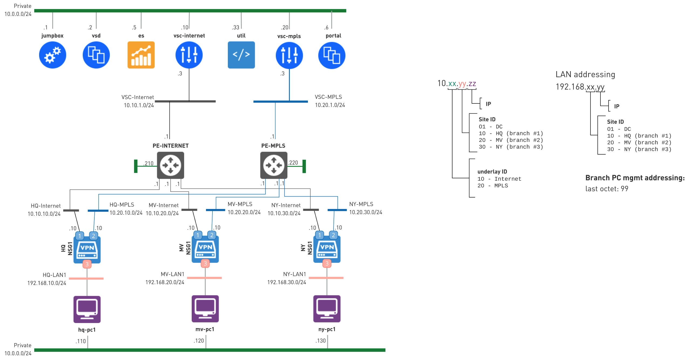

# 0860-VNS-MONITORING-GENERIC

* **version:** 1.0.0
* **tags:** Monitoring
* **requirements**: Nuage 5.3.3+, Docker on local Machine, CATS container image available on local machine
* **designer**: Arun Poonia
* **validation**: Outside of NuageX lab

This lab deploys a generic VNS lab with 2x NSG-Vs. The lab consists of an Organization comprised of a Mountain View site and a New York Branch site that are deployed over a single underlay (Internet).

Both branches are equipped with a single NSG, and each NSG has a single user-PC on the LAN subnet.

The automation harness provided with this lab enables a user to do any of the following:

* Demonstrate the SD-WAN Portal capabilities
* Using 3rd party monitoring tools to ingest flow data and objects from ES and VSD respectively

Once deployed and configured, the lab match what is in the following diagram:


The Mountain View and New York branch offices are equipped with a [Branch-PC image](https://nuagenetworks.zendesk.com/hc/en-us/articles/360010244033) that can be used to generate  traffic using some real-world applications.

# Use cases

Provide a generic VNS monitoring setup that includes two NSG-Vs and PC behind each NSG. This setup can be used to showcase our SD-WAN portal and/or 3rd party monitoring (with a single underlay in this version of the lab). The focus will mainly be on API calls to both VSD and ES.

# Uses

Clone this repo locally to your machine and follow below sections carefully: 


```
 git clone https://github.com/nuagex/nuagex-labs.git
 git checkout liveaction
 cd 0830-VNS-Monitoring-Generic
```

> Note: Changes are not merged yet, so you will need to checkout `liveaction` branch to use this repo. 

# Lab Deployment 

The lab deployment process is powered by [nuxctl](https://nuxctl.nuagex.io) CLI tool. The infrastructure deployment activities will be triggered once a user supplies the lab template available in this repo to the `nuxctl` tool.

The lab template is based on the **Nuage Networks 5.3.3U3** NuageX template and has additional infra components defined to support the use case demonstration.

Follow the steps below to deploy the lab:
1. Make sure you have installed `nuxctl` on your local machine. 
   - If not installed follow [nuxctl](https://nuxctl.nuagex.io) tool to install on your local machine
2. Update your `nuagex` username and password in [creds_file](./my_creds.yml) file.
3. **Update `ssh-key` on line [7](./nuxctl_0830-vns-monitoring_generic.yml#L7)**
   - Example snippet of lab `yml` file below **ssh public key** must match your public key:

   ```
     - name: demo  # WARNING: make sure to use your public key instead of the demo one
       key: <remove_current_key_and_update_your_key_here>
   ```
4. Run below command to create lab: 
```bash
# make sure to fill in your nuagex public key information in the lab template
# before running the command
nuxctl create-lab -c my_creds.yml -l  nuxctl_0830-vns-monitoring_generic.yml --wait
```
5. On successfull completion of the steps, you will see an output similiar to one below: 
```bash 

ID                        Name                    Status   Expires                 External IP      Password
------------------------  ----------------------  -------  ----------------------  ---------------  ----------------
<lab_id>                  vns-monitoring-labs     started  2019-02-23 00:31 (UTC)  XXXXXX           XXXXX
```
6. Note down `External IP` and `Password` which you will need in `Variables File` section. 

# CATS Docker Configuration 

To run CATS scripts on your lab, you will need to pull the CATS container image locally to your machine. 

1. Make sure docker is running on your machine. 
2. Pull CATS container image on your local machine using the following steps: 
   - Command: `docker pull nuagepartnerprogram/cats:5.3.2` 
   - This will pull CATS container repo locally to your machine.

# Lab Configuration

When the lab deployment is complete, proceed with automatic lab configuration using the following steps:

1. The lab configuration automation is saved in a set of [CATS](http://cats-docs.nuageteam.net) scripts contained in the [cats](./cats/) folder of this repo.
2. You will need to update the variables file located in  [vars.robot](./cats/vars.robot). You should only update variables that are marked with `TO_BE_FILLED_BY_A_USER` string, which are the minimum variable required before running the configuration scripts (see list below): 
   - `Jumpbox` address of your NuageX lab deployed in previous section. 
   - `vsd_password` password associated with `admin` user of VSD UI. 
   - `ssh_key_path` full path of your private key associated with `public_key` 
   - Example: 
    
    ```bash 
    ##############################
    #     CONNECTION PARAMETERS
    ##############################
    ${jumpbox_address}                124.252.X.X
    ${vsd_password}                   XXXXXXXXXXXXXX
    ${ssh_key_path}                   ~/.ssh/id_rsa
    ```

3. Run your lab configuration using the following steps: 
   - Change your working directory to `0830-VNS-Monitoring-Generic` folder. 
   - You will be mounting your `private_key` path and current directory where `cats` scripts are stored.
   - Run below command to complete lab cofigruation. 

   ```bash
   # being in the lab directory (where this README.md file is located)
   # flags:
   ## -X -- stop the execution if error occurs
   ## -e solo_run -- exclude the test cases marked with `solo_run` tag
   ## -v `pwd`/cats:/home/tests mounts your current working directory `cats` script to /home/tests directory of Docker Container
   ## -v ${HOME}/.ssh:/root/.ssh mounts your home directory private ssh-key file to /root/.ssh directory of Docker Container
   ## -X /home/tests allows to stop the container if error occurs and run /home/tests cats script from Docker Container

   docker run -t \
   -v ${HOME}/.ssh:/root/.ssh \
   -v `pwd`/cats:/home/tests \
   nuagepartnerprogram/cats:5.3.2 -X /home/tests
   ```
   - Example: 
  ```docker run -t -v ~/.ssh:/root/.ssh -v `pwd`/cats:/home/tests nuagepartnerprogram/cats:5.3.2 -X  /home/tests```

## Troubleshooting 

Every Lab configuration generates a report in the `cats/reports` directory, you can view the `output.xml` file to troubleshoot , if required.

- Make sure the key you are passing allows you to connect to Jumpbox VM using private key associated with your passed public key. This is mandatory.
- This script won't run if your are using any proxy to connect Jumpbox VM of your Lab. This is mandatory.


## Feeback 

Please send your feedback to nuagex@nuagenetworks.net
