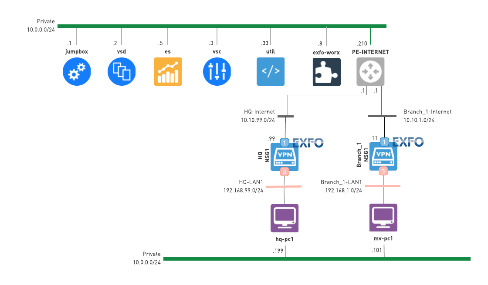

# 0910-VNS-EXFO-TEST-VNF

* **version:** 1.0.0
* **tags:** EXFO
* **requirements**: Nuage 5.4.1+
* **designer**: [Chandrashekar Dashudu](mailto:chandrashekar.dashudu@nokia.com)

This Lab demonstrates a joint integration between **Nuage Networks VNS** and [**EXFO WORX**](https://www.exfo.com/en/products/monitoring-assurance/monitoring-troubleshooting/exfo-worx/) solutions.

Once the lab is deployed and configured, a user will be able to test/learn/demonstrate the following features of a joint solution:

* EXFO VNF (Virtual Verifier) deployment and discovery of the VNF on EXFO WORX.
* Network test between the sites - proactive, ongoing network link testing performed by EXFO VNF agents.
* Service validation - establishing visibility between the cloud and on-premises VNF agents.
* Remote user troubleshooting - leveraging EXFO WORX dashboard to view and troubleshoot issues pertaining to EXFO VNFs.

# 1 Lab topology and components
Once a lab is deployed and configured using automation scripts, it will match the following diagram:



The lab models an Organization with a headquarters (HQ) and a branch site deployed over a single underlay (Internet).

Both the HQ and the branch are equipped with a Nuage Networks NSG running EXFO Virtual Verifier leveraging the **Hosted VNF** feature of Nuage Networks VNS.  

The LAB is also equipped with a VM running the EXFO WORX dasboard used for registering the VNFs, creating `On Demand Tests` for use case demonstration and  troubleshooting.

The headquarters site user devices and branch offices user devices are emulated using the [Branch-PC image](https://nuagenetworks.zendesk.com/hc/en-us/articles/360010244033) which allows to generate and analyze traffic as well as run some real-world applications. Although the devices are not needed to demonstrate the features of a joint solution, they are used here as the Installer PCs to automatically bootstrap the NSGs.

# 2 Deployment
The lab is meant to be deployed on [NuageX](https://nuagex.io) platform and is automated by the [nuxctl](https://nuxctl.nuagex.io) CLI tool. All of the infrastructure deployment will be completed after a user runs the the tool against the [lab template](nuxctl_0910-vns-exfo.yml) supplied within this repo.

The lab is based on the NuageX's **Nuage Networks 5.4.1** template and has additional infra components required to support the EXFO integration and use case demonstration.

## 2.1 Prerequisites
1. [Download](https://nuxctl.nuagex.io#download) `nuxctl` for your operating system.
2. Download the [nuxctl_0910-vns-exfo.yml](nuxctl_0910-vns-exfo.yml) lab definition file created for this lab or clone this repository as a whole.
3. Replace the [public key](nuxctl_0910-vns-exfo.yml#L7) in the lab definition file with the public key you have in your NuageX user account.

## 2.2 Starting deployment process
To initiate the deployment routine proceed with the following command:
```bash
# make sure to specify your nuagex public key in the lab template
# before running the command
nuxctl create-lab -l nuxctl_0910-vns-exfo.yml --wait
```

Once a deployment process ends successfully a user is presented with the parameters of a newly created lab. Take a note of the `Password` and `External IP` parameters as they will be referenced in the configuration process.

# 3 Configuration
After the lab deployment is complete, proceed with automatic lab configuration. Lab configuration is saved in a set of [CATS](http://cats-docs.nuageteam.net) scripts contained in the [cats](./cats/) directory of this repo.

> **WARNING**: since Nuage Networks Hosted VNF feature requires a second disk to be added to the NSG-V image, a standard user will not be able to add it. Please contact the NuageX team on how to convert the regular NSG-V image to the VNF-capable one **before starting the configuration process** (e-mail nuagex+EXFO@nuagenetworks.net with your lab ID and request).

The configuration is performed by the CATS tool running in a container on the lab's Jumpbox VM. In order to pull the CATS container and this repository to the lab's jumpbox VM follow the steps below:

1. Login to the jumpbox VM using your nuagex SSH key and the Lab's External IP.
   ```
   ssh -i <path_to_your_nuagex_private_key> admin@<lab_public_ip>
   ```

2. Pull down the CATS container and clone this repository by running the setup script with this command:
   ```bash
   # issued on the jumpbox
   curl https://raw.githubusercontent.com/nuagex/nuagex-labs/master/helpers/setup_5.3.2.sh | bash
   ```

## 3.1 Variables file
The configuration variables are stored in a single [vars.robot](./cats/vars.robot) file. At a minimum, a user needs to fill in the values there on the lines marked with `TO_BE_FILLED_BY_A_USER` string. These variables must be filled out before running the configuration scripts.

### 3.1.1 VSD login
Authentication and authorization with VSD is needed in order to configure objects via VSD API. Make sure to add the VSD password (obtained in the end of the deployment procedure) on line [83](./cats/vars.robot#L83) of the variables file.

### 3.1.2 VNF names
The automation scripts assume that the EXFO Virtual Verifier names configured in EXFO WORX web application match the names of the VNF instances defined in Nuage Networks VSD.  
To comply with this naming requirement it is recommended to create the Agents in the EXFO WORX web app and then use these names in the [vars.robot](./cats/vars.robot) file. Specifically, these names are defined on the lines [67-68](./cats/vars.robot#L67-L68).  
For example, if the EXFO agents are created with the names `nuage_agent1` and `nuage_agent2` then these names should be set as the VNF names on the above mentioned lines of the variables file.

### 3.1.3 VNF image path
The paths to the EXFO Agent image and a corresponding md5 file should be provided by a user on lines [69-70](./cats/vars.robot#L69-L70). The automation scripts will download the image file and its checksum to the Util VM, which means that Util VM should have reachability to the data storage hosting these files.

You can [contact NuageX representatives](mailto:nuagex+EXFO@nuagenetworks.net) with the request to obtain the paths to these files.

### 3.1.4 Boot ISO
Initial configuration of the EXFO agents is done by means of the boot ISO files. The steps to generate these iso files can be found in the Integration guide with screenshots. Fill in the ISO download links on the lines [77-78](./cats/vars.robot#L77-L78) and automation scripts will download the ISO files for the agents accordingly.

## 3.2 Starting configuration process
The configuration process will handle all of the heavy-lifting of the lab configuration. Starting with overlay object creation as well as NSG bootstrapping and activation, finishing with the creation of the VNFs.

To launch the configuration sequence proceed with the following command issued on the labs jumpbox VM:

```bash
# issued on the jumpbox VM
# flags
## -X -- stop the execution on first error
docker run -t \
  -v ${HOME}/.ssh:/root/.ssh \
  -v /home/admin/nuagex-labs/0910-VNS-EXFO-TEST-VNF/cats:/home/tests \
  nuagepartnerprogram/cats:5.3.2 -X /home/tests
```

Note, that in order to provide CATS container with passwordless access to the labs components the Jumpbox keys are shared with the container.  
Jumpbox's `${HOME}/.ssh` folder contents is exposed to the CATS container and mounted there by the `/root/.ssh` path. In effect, the `id_rsa` key on the Jumpbox will be available to the CATS container by the `/root/.ssh/id_rsa` path hence its configured on line [84](./cats/vars.robot#L84) of the variables file.


The configuration is successful if every step is marked with the green PASS status. The configuration execution log can be found under `cats/reports` directory (the full path is provided by CATS at the end of the execution output).

> Note, the automated lab configuration does not create agents in the ObserverLive application, a user needs to manually create them before running the CATS scripts.

# 4 Use cases
Use cases are to be provisioned by a the user manually after lab configuration completes.
