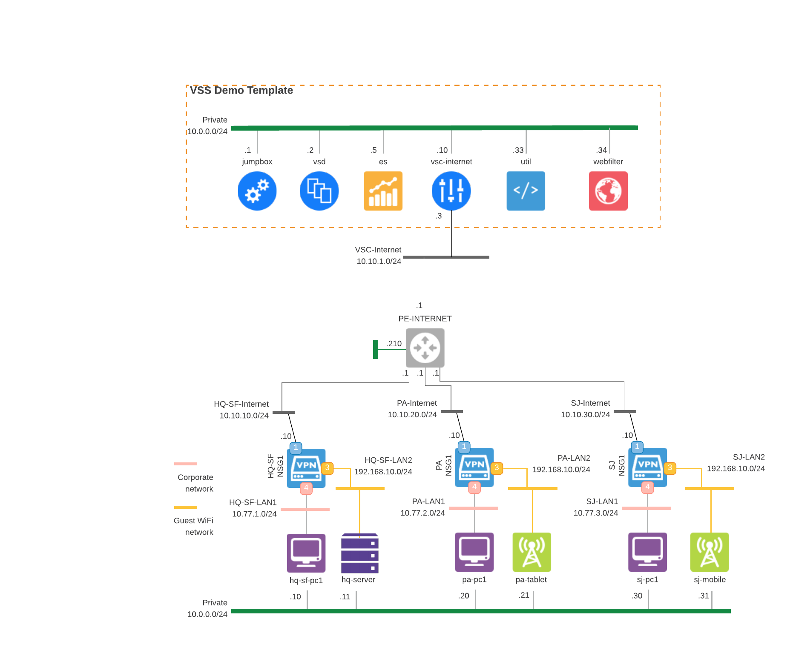

# 0930-VNS-VSS-DEMO

* **version:** 1.0.0
* **tags:** VSS
* **requirements**: Nuage 6.0.5
* **designer**: [Anton Budilovskiy](mailto:anton.budilovskiy@nokia.com)

This Lab demonstrates **Nuage Networks VNS** SD-WAN Security features.

Once the lab is deployed and configured, a user will be able to test/learn/demonstrate the following features on SD-WAN portal:

* Prevent
   - Implement L4-L7 stateful firewall
   - Enforce URL filtering
   - Control access to selected SaaS applications

* Detect
   - Display flow visualization
   - Present real-time analytics
   - Security Alarms

* Respond
   - Monitor security events
   - React to the threat upon detection

# 1 Lab topology and components
Once a lab is deployed and configured using automation scripts, it will match the following diagram:



The lab models an Organization with a headquarters (HQ) and branch sites deployed over single underlay (Internet).

Both the HQ and the branchs are equipped with a Nuage Networks NSG. The headquarters site user devices and branch offices user devices are emulated using the [Branch-PC image](https://nuagenetworks.zendesk.com/hc/en-us/articles/360010244033) which allows to generate and analyze traffic as well as run some real-world applications. Although the devices are not needed to demonstrate the features of a joint solution, they are used here as the Installer PCs to automatically bootstrap the NSGs.

# 2 Deployment
The lab is meant to be deployed on [NuageX](https://nuagex.io) platform and is automated by the [nuxctl](https://nuxctl.nuagex.io) CLI tool. All of the infrastructure deployment will be completed after a user runs the the tool against the [lab template](nuxctl_0930-vns-vss-demo.yml) supplied within this repo.

The lab is based on the NuageX's **Base VNS Template - 6.0.5 - Single Underlay** template and has additional infra components required to support the SD-WAN and use case demonstration.

## 2.1 Prerequisites
1. [Download](https://nuxctl.nuagex.io#download) `nuxctl` for your operating system.
2. Download the [nuxctl_0930-vns-vss-demo.yml](nuxctl_0930-vns-vss-demo.yml) lab definition file created for this lab or clone this repository as a whole.
3. Replace the [public key](nuxctl_0930-vns-vss-demo.yml#L7) in the lab definition file with the public key you have in your NuageX user account.

## 2.2 Starting deployment process
To initiate the deployment routine proceed with the following command:
```bash
# make sure to specify your nuagex public key in the lab template
# before running the command
nuxctl create-lab -l nuxctl_0930-vns-vss-demo.yml --wait
```

Once a deployment process ends successfully a user is presented with the parameters of a newly created lab. Take a note of the `Password` and `External IP` parameters as they will be referenced in the configuration process.

# 3 Configuration
After the lab deployment is complete, proceed with automatic lab configuration. Lab configuration is saved in a set of [CATS](http://cats-docs.nuageteam.net) scripts contained in the [cats](./cats/) directory of this repo.

The configuration is performed by the CATS tool running in a container on the lab's Jumpbox VM. 
1. Login to the jumpbox VM using your nuagex SSH key and the Lab's External IP.
   ```
   ssh -i <path_to_your_nuagex_private_key> admin@<lab_public_ip>
   ```
2. Clone github repo on your jumpbox VM using below command: 
   ```
   git clone https://github.com/nuagex/nuagex-labs.git
   ```

## 3.1 Starting configuration process
The configuration process will handle all of the heavy-lifting of the lab configuration. Starting with overlay object creation as well as NSG bootstrapping and activation, finishing with the creation of traffic scripts between NSGs PCs to support LiveAction traffic.

To launch the configuration sequence proceed with the following command issued on the labs jumpbox VM:

```bash
# issued on the jumpbox VM
# flags
## -X -- stop the execution on first error
docker run -t -e "CATS_VSD_API_VER=v6_0" -v ${HOME}/.ssh:/root/.ssh -v /home/admin/nuagex-labs/0930-VSS-DEMO/cats:/home/tests nuagepartnerprogram/cats:6.0.3 -X /home/tests/
```

Note, that in order to provide CATS container with passwordless access to the labs components the Jumpbox keys are shared with the container.  
Jumpbox's `${HOME}/.ssh` folder contents is exposed to the CATS container and mounted there by the `/root/.ssh` path. In effect, the `id_rsa` key on the Jumpbox will be available to the CATS container by the `/root/.ssh/id_rsa` path hence its configured on line [8](./cats/vars.robot#L8) of the variables file.


The configuration is successful if every step is marked with the green PASS status. The configuration execution log can be found under `cats/reports` directory (the full path is provided by CATS at the end of the execution output).

> Note, the automated lab configuration creates cronjobs on each PC on NSG side to support traffic generation.

# 4 Troubleshooting

You must update physical address on each NSG. Even though CATS scripts add NSG address please verify from Nuage Networks VSD that addresses are reflecting on Nuage Networks VSD.